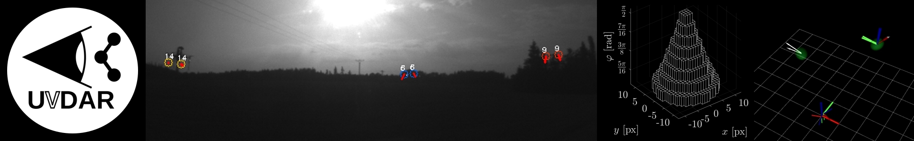

# UVDAR Gazebo plugin



| Build status | [](https://github.com/ctu-mrs/uvdar_gazebo_plugin/actions) | [](https://github.com/ctu-mrs/uvdar_gazebo_plugin/actions) |
|--------------|-------------------------------------------------------------------------------------------------------------------------------------------------------|------------------------------------------------------------------------------------------------------------------------------------------------------|

## Description
This package contains plugins for generating synthetic outputs emulating the images produced by UV-sensitive cameras onboard of MAVs, observing blinking UV LEDs attached to targets
The output is used in simulations involving the [UVDAR System](https://github.com/ctu-mrs/uvdar_core) for mutual relative localization of MAVs

This package was developed for the [Gazebo robotic simulator](http://gazebosim.org/) and it has been tested with version 9.13.
Compatibility with other versions is currently not guaranteed.

## System requirements

#### Hardware:
Fairly powerful CPU. Ideally have at least one core/thread per each camera included in the simulation.
Additionally, the requirements increase further if you enable obstacle occlusions - this is necessary to test the effects of partial or complete occlusions on the precision of the estimation


#### Software
  * [ROS (Robot Operating System)](https://www.ros.org/) Melodic Morenia
  * [Gazebo robotic simulator](http://gazebosim.org/) - Gazebo simulator v. 9.13
  * [mrs_msgs](https://github.com/ctu-mrs/mrs_msgs) - ROS package with message types used by the MRS group
  * [uvdar_core](https://github.com/ctu-mrs/uvdar_core) - Processing of the UVDAR inputs

#### For testing
  * [mrs_uav_system](https://github.com/ctu-mrs/mrs_uav_system) Our ROS-based ecosystem for flying and testing multi-UAV systems. Includes simulation with examples of attaching this plugin to objects in the simulated world

## Installation
Install the dependencies.
Clone this repository into a ROS workspace as a package.
If you are using the `mrs_modules` meta package (currently only accessable internally to MRS staff, to be released at later date), this repository is already included.
Build the package using catkin tools (e.g. `catkin build uvdar_gazebo_plugin`)

## Testing
See in [uvdar_core](https://github.com/ctu-mrs/uvdar_core)

## ROS 2 LED image model

The Gazebo Sim camera plugin projects every visible LED with the OCamCalib
model and computes its integrated sensor signal as

```text
I(theta) = ((m + 1) P / (2 pi)) cos(theta)^m
S_ADU = (I(theta) / d^2) A_aperture tau t_exp
        (lambda / (h c)) eta_QE / g_e/ADU.
```

`P` is total LED radiant power, `m` is its Lambertian order, and `theta` is
measured from the LED link's configured local emission axis. `A_aperture` is
the equivalent entrance-pupil area, `tau` is combined lens/filter
transmission, `t_exp` is exposure time, `lambda` is LED wavelength, `eta_QE`
is sensor quantum efficiency and `g_e/ADU` is the sensor conversion gain.
There is no distance or exposure-dependent visibility cutoff: inverse-square
attenuation, mono8 quantization, and the downstream detector threshold make a
source disappear naturally.

The signal is integrated over a subpixel Gaussian point-spread function before
all LEDs are added and the mono8 sensor is clipped. This produces a bright
centre, saturation bloom and correct subpixel centroids instead of uniform
white disks.

The supplied SDF configuration uses 1 W, first-order Lambertian emitters and
an explicitly parameterized optical chain. The settings are exposed as
`power_w`, `lambertian_order`, `emission_axis`, `exposure_us`,
`aperture_diameter`, `optical_transmission`, `quantum_efficiency`,
`wavelength_nm`, `electrons_per_adu`, and `psf_sigma` SDF elements.
`UVDAR_SIM_LED_GAIN`, `UVDAR_SIM_EXPOSURE_US`, and `UVDAR_SIM_PSF_SIGMA`
provide runtime overrides. The image background remains the configured flat
level; no Gazebo scene rendering is performed.

## Acknowledgements

### MRS group
This work would not be possible without the hard work, resources and support from the [Multi-Robot Systems (MRS)](http://mrs.felk.cvut.cz/) group from Czech Technical University.

### Included libraries
This package contains the following third-party libraries by the respective authors:
  * [OCamCalib](https://sites.google.com/site/scarabotix/ocamcalib-toolbox) calibration system by Davide Scaramuzza - only the C++ sources
